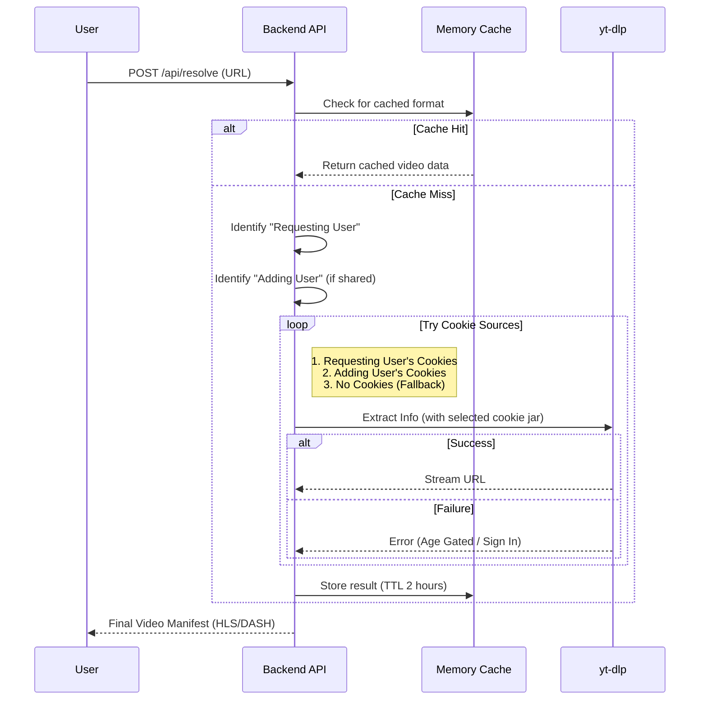
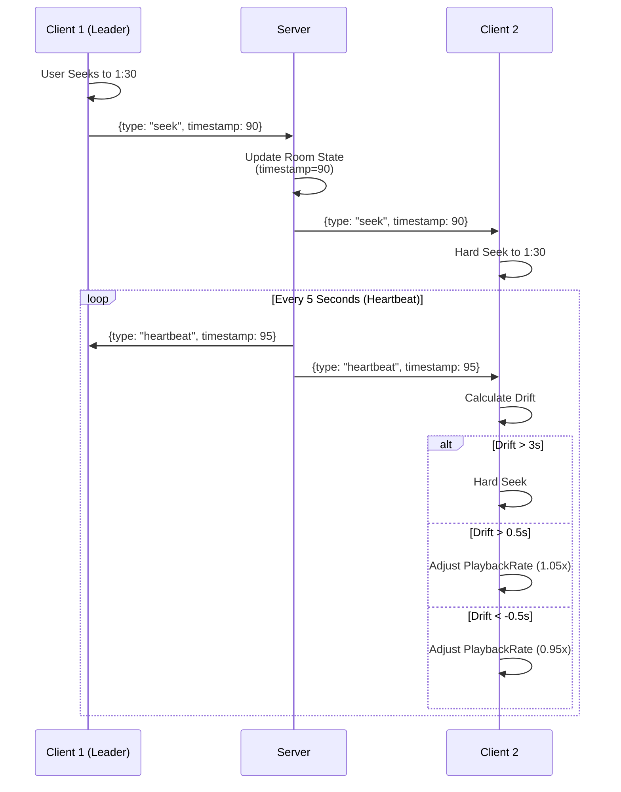

# Watch Together - Specification

## Overview
**Watch Together** is a real-time collaborative video player that allows users to watch content from YouTube, Twitch, and 1800+ other sites simultaneously. It focuses on maximum compatibility, robust synchronization, and a premium user experience.

## Architecture

The system uses a microservices architecture orchestrated by Docker Compose.

```mermaid
graph TD
    User[User Browser] -->|HTTPS| CF[Cloudflare Tunnel]
    CF -->|HTTP| Nginx[Nginx Reverse Proxy]
    
    subgraph "Docker Network"
        Nginx -->|/api/* & /ws/*| Backend[FastAPI Backend]
        Nginx -->|/*| Frontend[Next.js Frontend]
        
        Backend -->|Resolve| YTDLP[yt-dlp Library]
        Backend -->|Execute JS| Node[Node.js Runtime]
        Backend -->|Store| FS[File System (Data/Cookies)]
    end
    
    YTDLP -->|Fetch Manifests| External[YouTube / Twitch / etc]
    Backend -->|Proxy Segments| External
```

## Core Workflows

### 1. Video Resolution & Cookie Logic
The backend uses a sophisticated multi-pass strategy to resolve video URLs, aiming to bypass age-gating and regional restrictions.



### 2. Synchronization Engine
To ensure all users see the same frame at the same time, we implemented a custom sync protocol over WebSockets.



### 3. HLS/DASH Proxy
To bypass CORS and handle segmented streaming from restricted sources:

1. **Manifest Rewriting**: The backend downloads the master manifest (`.m3u8` or `.mpd`) and rewrites all segment URLs to point to `/api/proxy?url=...`.
2. **Segment Proxying**: When the browser requests a segment:
   - Backend fetches the segment from the value in `url` query param.
   - Forwards headers (Range, User-Agent) to support seeking.
   - Streams chunks back to the client (`StreamingResponse`).

## Technical Stack

### Frontend
- **Framework**: Next.js 16 (React 19)
- **Styling**: TailwindCSS 4
- **Player**: `hls.js` customized with hooks (`useDashSync`, `useHlsPlayer`).
- **State**: React Hooks + LocalStorage for persistence.
- **Components**:
  - `CustomPlayer`: Unified wrapper for HLS/DASH functionality.
  - `SortableQueue`: Drag-and-drop queue using `@dnd-kit`.

### Backend
- **Framework**: FastAPI (Python 3.11)
- **Concurrency**: Fully Async (`asyncio` + `aiofiles`).
- **Validation**: Pydantic models.
- **Tools**:
  - `yt-dlp`: patched with `bgutil-ytdlp-pot-provider` for PO Token generation.
  - `node`: Runtime for executing JS challenges from YouTube.

## Data & Persistence
- **Room State**: JSON files in `data/rooms.json`.
- **Cookies**: Individual Netscape cookie files in `data/cookies/{email}.txt`.
- **Cache**:
  - **Manifests**: In-memory LRU cache.
  - **Segments**: `yt-dlp` disk cache in `data/yt_dlp_cache`.

## Roadmap status

### Completed
- [x] Universal Resolver (yt-dlp integration)
- [x] Room System with WebSocket Sync
- [x] Queue System (Add, Remove, Reorder)
- [x] Smart HLS Proxy (CORS bypass)
- [x] User Identity via Cloudflare Access
- [x] Cookie Upload UI & Management
- [x] Drag & Drop Sortable Queue
- [x] Audio Normalization & Quality Selection

### Planned
- [ ] User playlist saving
- [ ] Chat system (beyond system messages)
- [ ] Mobile-optimized layout
